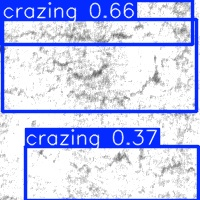
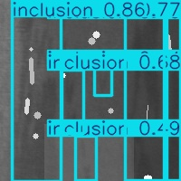
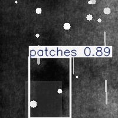
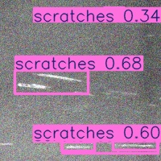

# BFS

The code file is currently being organized ..


# [Paper Title]

Rail defect detection based on multi-scale feature enhancement and fine-grained perception fusion

This repository provides the official implementation and experimental resources for our paper. It includes the model framework, dataset descriptions, environment configuration, and representative detection results.

---

## Visual Results

Below are some representative detection examples produced by the proposed method.

<table>
  <tr>
    <td align="center">
      <br>
      <sub>Crazing</sub>
    </td>
    <td align="center">
      <br>
      <sub>Inclusion</sub>
    </td>
  </tr>
  <tr>
    <td align="center">
      <br>
      <sub>Patches</sub>
    </td>
    <td align="center">
      <br>
      <sub>Scratches</sub>
    </td>
  </tr>
</table>

---

## Preparation

### Environment

This project is developed based on the YOLO series framework. A recommended environment is listed below:

- Python 3.10
- PyTorch 2.1.2
- Torchvision 0.16.2
- CUDA 11.8
- OpenCV 4.8.0
- NumPy 1.24+
- Pillow
- Matplotlib
- tqdm
- PyYAML

You may create the environment with the following commands:

```bash
conda create -n yolo_env python=3.10
conda activate yolo_env
pip install torch==2.1.2 torchvision==0.16.2 --index-url https://download.pytorch.org/whl/cu118
pip install opencv-python==4.8.0.76 numpy matplotlib pillow tqdm pyyaml


## Datasets

This work involves experiments on multiple public datasets as well as a private dataset.

### COCO2017

COCO2017 is a large-scale benchmark for object detection, instance segmentation, and related computer vision tasks. In this project, it can be used for pretraining, generalization analysis, and transferability evaluation.

**Official website:** https://cocodataset.org/

### DOTA-v1.0

DOTA-v1.0 is a widely used aerial object detection dataset containing objects with large scale variations, arbitrary orientations, and complex backgrounds. It is suitable for evaluating the robustness and scalability of detection algorithms.

**Official website:** https://captain-whu.github.io/DOTA/

### NEU-DET

NEU-DET is a classical steel surface defect detection dataset containing six common defect categories.

The defect categories include:

- Crazing
- Inclusion
- Patches
- Pitted Surface
- Rolled-in Scale
- Scratches

### Private Dataset

In addition to public datasets, experiments are also conducted on a private dataset collected from real industrial scenarios. This dataset is used to further validate the effectiveness, adaptability, and practical deployment capability of the proposed method under complex conditions.

> Note: Due to privacy or industry confidentiality restrictions, private data gatherings are made public upon request.

---

## Data Organization

A recommended directory structure is shown below:

```bash
datasets/
├── COCO2017/
│   ├── images/
│   ├── labels/
│   └── annotations/
├── DOTA-v1.0/
│   ├── images/
│   ├── labels/
│   └── annotations/
├── NEU-DET/
│   ├── images/
│   ├── labels/
│   └── annotations/
└── Private/
├── images/
├── labels/
└── annotations/
```

Please modify the dataset configuration files according to your local storage paths before training or evaluation.
